# Laboratorio 3 - Grupo 6  |  Sistemas Operativos 2023 

#Integrantes
    - Afonso, Santiago
    - Angeli, Mateo
    - Di Forte Reusa, Federico
    - Usaj, Santiago

# Indice

[TOC]

# Introducción

En este trabajo de laboratorio nos dedicamos a entender el funcionamiento del planificador de procesos de xv6-riscv, como administra sus recursos y como se comporta ante diferentes escenarios de exigencias de Input/Output o poder de procesamiento. Para esto analizamos y modificamos el algoritmo original para entender su funcionamiento e implementamos un nuevo algoritmo basado en las políticas de MLFQ. Luego, tomamos mediciones para ver como se comportaban los procesos en estos distintos escenarios.


---
# Resolución del laboratorio

## Primera Parte

1. **¿Qué política de planificación utiliza xv6-riscv para elegir el próximo proceso a ejecutarse?**
Xv6-riscv utiliza la politica de planificacion RR (Round Robin). Esta respuesta la podemos encontrar en la seccion 7.10 "Real World" del libro de Xv6. El codigo del planificador se encuentra en el archivo `proc.c`

```c
// Per-CPU process scheduler.
// Each CPU calls scheduler() after setting itself up.
// Scheduler never returns.  It loops, doing:
//  - choose a process to run.
//  - swtch to start running that process.
//  - eventually that process transfers control
//    via swtch back to the scheduler.
void
scheduler(void)
{
  struct proc *p;
  struct cpu *c = mycpu();
  
  c->proc = 0;
  for(;;){
    // Avoid deadlock by ensuring that devices can interrupt.
    intr_on();

    for(p = proc; p < &proc[NPROC]; p++) {
      acquire(&p->lock);
      if(p->state == RUNNABLE) {
        // Switch to chosen process.  It is the process's job
        // to release its lock and then reacquire it
        // before jumping back to us.

        p->state = RUNNING;
        c->proc = p;
        swtch(&c->context, &p->context);

        // Process is done running for now.
        // It should have changed its p->state before coming back.
        c->proc = 0;
      }
      release(&p->lock);
    }
  }
}
```

2. **¿Cuánto dura un quantum en xv6-riscv?**
La duracion del quantum la podemos encontrar en el archivo `start.c` en la funcion `timerinit`. Donde nos dice que es de 0.1 segundos aprox en qemu. Pero esto va a depender de la velocidad de cada procesador, ya que en realidad lo que se setea es la cantidad de ciclos permitidos. En este caso ese valor esta seteado en 1000000 ciclos.

```c
// arrange to receive timer interrupts.
// they will arrive in machine mode at
// at timervec in kernelvec.S,
// which turns them into software interrupts for
// devintr() in trap.c.
void
timerinit()
{
  // each CPU has a separate source of timer interrupts.
  int id = r_mhartid();

  // ask the CLINT for a timer interrupt.

  // Original Quantum.
  int interval = 1000000; // cycles; about 1/10th second in qemu.

  *(uint64*)CLINT_MTIMECMP(id) = *(uint64*)CLINT_MTIME + interval;

  // prepare information in scratch[] for timervec.
  // scratch[0..2] : space for timervec to save registers.
  // scratch[3] : address of CLINT MTIMECMP register.
  // scratch[4] : desired interval (in cycles) between timer interrupts.
  uint64 *scratch = &timer_scratch[id][0];
  scratch[3] = CLINT_MTIMECMP(id);
  scratch[4] = interval;
  w_mscratch((uint64)scratch);

  // set the machine-mode trap handler.
  w_mtvec((uint64)timervec);

  // enable machine-mode interrupts.
  w_mstatus(r_mstatus() | MSTATUS_MIE);

  // enable machine-mode timer interrupts.
  w_mie(r_mie() | MIE_MTIE);
}
``` 

3. **¿Cuánto dura un cambio de contexto en xv6-riscv?**
La funcion `swtch` es la encargada del context switch. La cual en realidad es el archivo `swtch.S` y demora 28 instrucciones para realizarlo.

```s
# Context switch
# void swtch(struct context *old, struct context *new);
# Save current registers in old. Load from new.	

.globl swtch
swtch:
        sd ra, 0(a0)
        sd sp, 8(a0)
        sd s0, 16(a0)
        sd s1, 24(a0)
        sd s2, 32(a0)
        sd s3, 40(a0)
        sd s4, 48(a0)
        sd s5, 56(a0)
        sd s6, 64(a0)
        sd s7, 72(a0)
        sd s8, 80(a0)
        sd s9, 88(a0)
        sd s10, 96(a0)
        sd s11, 104(a0)

        ld ra, 0(a1)
        ld sp, 8(a1)
        ld s0, 16(a1)
        ld s1, 24(a1)
        ld s2, 32(a1)
        ld s3, 40(a1)
        ld s4, 48(a1)
        ld s5, 56(a1)
        ld s6, 64(a1)
        ld s7, 72(a1)
        ld s8, 80(a1)
        ld s9, 88(a1)
        ld s10, 96(a1)
        ld s11, 104(a1)
        
        ret
``` 

4. **¿El cambio de contexto consume tiempo de un quantum?**
Si consume. Esto se debe a como el quantum en xv6 es global y no independiente a cada proceso, mientras se realiza el cambio de contexto, el quantum sigue corriendo.

5. **¿Hay alguna forma de que a un proceso se le asigne menos tiempo?**
El Quantum dura siempre lo mismo, esta seteado como interrupcion global. Pero que pasa si un proceso termina de ejecutarse antes que finalice el Quantum? En ese caso el Quantum no se resetea, sino que el proximo proceso elegido tendra el tiempo faltante para completar el Quantum.

6. **¿Cúales son los estados en los que un proceso pueden permanecer en xv6-riscv y que los hace cambiar de estado?**
Los estados en los que pueden estar los procesos son: UNUSED, USED, SLEEPING, RUNNABLE, RUNNING y ZOMBIE. Estos se encuentran en `proc.h`.

```c
enum procstate { UNUSED, USED, SLEEPING, RUNNABLE, RUNNING, ZOMBIE };
``` 

---
## Segunda Parte

En la segunda parte del laboratorio, analizamos el comportamiento de programas que son cpu-bound o IO-bound con la politica por defecto de xv6 (round-robin).
Más especificamente, analizamos como varia el comportamiento de estos programas al cambiar el Quantum del planificador y como se comportan al estar corriendo en paralelo. Para esto, tomamos mediciones de 5 casos distintos con el Quantum original (1M) y con el Quantum reducido por 10 (100K).

### Caso 1 (1 IO-bench corriendo solo)

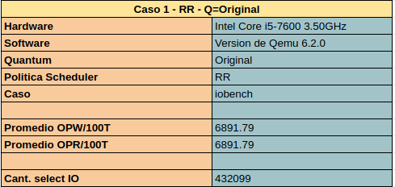
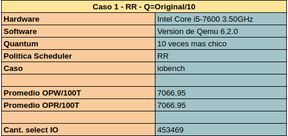


Se puede ver una muy leve mejora en la cantidad de operaciones cada 100 ticks al reducir la duracion del quantum. Esto se debe a que al darle menos tiempo para ejecutarse al resto de los procesos en la pc, se genera una mayor cantidad de selecciones del proceso IO-Bench.


### Caso 2 (1 CPU-bench corriendo solo)

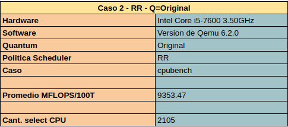
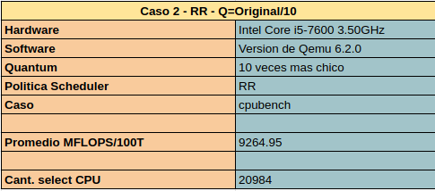


En este caso se puede ver como el rendimiento de CPU-Bench empeora levemente al reducirle el quantum. Esto se debe a que al reducir el quantum vamos a obtener mas interrupciones y cambios de contexto que antes. Por ende, durante la ejecucion se va "perdiendo" mas tiempo y vamos a realizar menos operaciones que antes. Esta diferencia podria ser mas notoria si se estuviese testeando en una pc con peor hardware, ya que cada context-switch tomaria en porcentaje mayor tiempo.


### Caso 3 (1 IO-bench y 1 CPU-bench corriendo en paralelo)

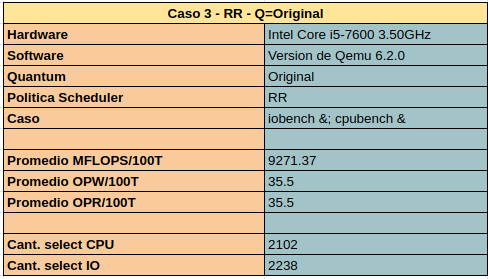
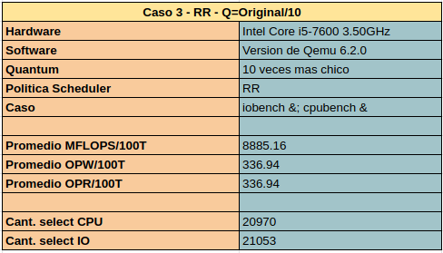


Lo primero que destaca al comparar los resultados de este caso con los anteriores es que el proceso IO-Bench pierde muchisimo rendimiento al ser ejecutado en paralelo con un programa que utiliza el procesador todo el tiempo que le da el sistema operativo (CPU-Bench). Esto era de esperarse, ya que la política que estamos utilizando es Round-Robin.
Tambien se puede ver que al reducir el quantum, IO-Bench es notoriamente beneficiado (tiene casi x10 en su rendimiento), mientras que CPU-Bench "pierde" muy poco rendimiento. Esto se debe a que en cada ejecucion de CPU-Bench ahora se toma menos tiempo (casi 10 veces menos), lo cual le permite al SO volver a ejecutar IO-Bench mas rapido.


### Caso 4 (2 CPU-bench corriendo en paralelo)

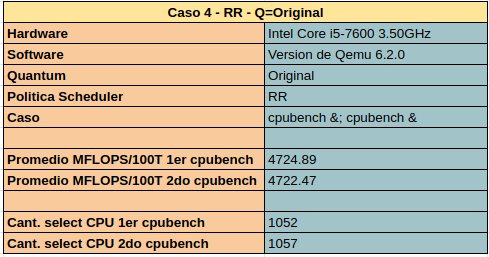
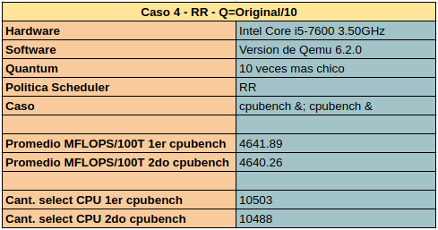


En este caso no hay mucho para decir, mas que al ejecutar dos procesos de CPU-Bench en paralelo, el rendimiento es practicamente la mitad en cada uno (respecto a las pruebas del caso 2), restandole el tiempo que se "pierde" en realizar context-switch. De nuevo, esta perdida de rendimiento seria mayor en un sistema con un hardware menos potente.


### Caso 5 (1 IO-bench y 2 CPU-bench corriendo en paralelo)

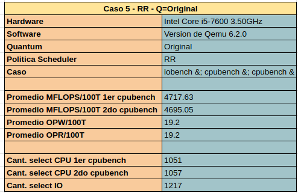
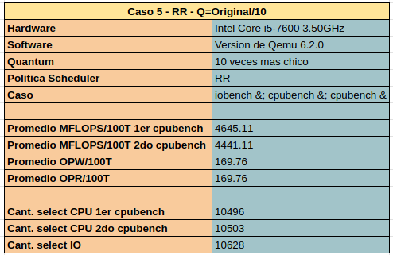


Los resultados de este caso son similares a los del caso 3, pero con una mayor reduccion del rendimiento del proceso IO-Bench debido a que ahora debe esperar a que terminen 2 procesos CPU-Bench para volver a ejecutar. Las relaciones son muy parecidas, con una mejora de casi 10 veces con el quantum reducido y sin mucha perdida en los procesos CPU-Bench.


### Conclusiones

De estas mediciones se puede ver que la configuracion por defecto de la politica de xv6 (Round-Robin) claramente tiende a beneficiar a los programas con gran necesidad de computo, por sobre a los que necesitan una mayor interaccion e intercambio de entrada/salida.
Otra conclusión que se puede hacer, es que al reducir el valor del quantum se beneficia a los procesos mas interactivos, sin perjudicar a gran escala a los que requieren principalmente poder de computo. Esto sucede porque este planificador cicla de forma ordenada los procesos a ejecutar y al darle menos tiempo a cada uno, asegura que todos se ejecuten mas veces. 
*Aclaracion: reducir a un numero muy chico el quantum no es una solución mágica, ya que el SO pasaria a perder mucho tiempo en context-switch*


---
## Tercera Parte

En la tercera parte de este laboratorio se empezó a realizar cambios al planificador de xv6 para que sus politicas se parezcan un poco mas a las de un planificador MLFQ. 
Los cambios realizados fueron la creación de un nuevo campo `priority` en la `struct proc` y cambios en proc.c para que cumpla con las siguientes politicas:
    - **MLFQ regla 3**: Cuando un proceso se inicia, su prioridad será máxima.
    - **MLFQ regla 4**: Descender de prioridad cada vez que el proceso pasa todo un quantum realizando cómputo. Ascender de prioridad cada vez que el proceso se bloquea antes de terminar su quantum.
	
En `struct proc`, la cual se ubica en `proc.h`, agregamos el campo `int priority` la cual guarda el nivel de prioridad del proceso.

```c
struct proc {
  struct spinlock lock;

  int chosen_counter;   // Number of times the process was chosen
  int last_exec;        // Tick of last execute 
  int priority;         // Level of priority of the process [0 , NPRIO-1]
  .
  .  
};
```

La inicializacion de estos valores se realizo en el archivo `proc.c` dentro de la funcion `allocproc`

```c
static struct proc*
allocproc(void)
{
  struct proc *p;
  .
  .
  .
  // Inicializamos nuestros contadores
  p->chosen_counter = 0;
  p->last_exec = 0;
  p->priority = NPRIO - 1;
  .
  .
}
```
El control sobre el nivel de prioridad del proceso se implemento en las funciones `yield` y `sleep`. Esto se debe a que la funcion `yield` es llamada cuando el proceso utilizo todo el quantum disponible, y la funcion `sleep` es llamada cuando el proceso termino antes de finalizar el quantum. En otras palabras, cuando se llama a `yield` debemos bajarle la prioridad al proceso, y cuando se llama a `sleep` debemos aumentar su prioridad. 

```c
// Give up the CPU for one scheduling round.
void
yield(void)
{
  struct proc *p = myproc();
  acquire(&p->lock);
  p->state = RUNNABLE;

  // Le bajamos la prioridad si uso todo el Quantum
  if (p->priority != 0) {

    p->priority--; 

  }
  
  sched();
  release(&p->lock);
}
```

```c
// Atomically release lock and sleep on chan.
// Reacquires lock when awakened.
void
sleep(void *chan, struct spinlock *lk)
{
  struct proc *p = myproc();
  
  // Must acquire p->lock in order to
  // change p->state and then call sched.
  // Once we hold p->lock, we can be
  // guaranteed that we won't miss any wakeup
  // (wakeup locks p->lock),
  // so it's okay to release lk.

  acquire(&p->lock);  //DOC: sleeplock1
  release(lk);

  // Go to sleep.
  p->chan = chan;
  p->state = SLEEPING;

  // Le subimos la prioridad si termino antes de agotar el Quantum
  if (p->priority != NPRIO-1) {

    p->priority++;

  }

  sched();

  // Tidy up.
  p->chan = 0;

  // Reacquire original lock.
  release(&p->lock);
  acquire(lk);
}
```
Los cambios realizados no alteran el funcionamiento del planificador original, por lo que este sigue siendo Round-Robin. La ventaja de estos cambios es que ahora se puede observar como varian las prioridades de cada proceso.
Cuando volvemos a realizar todo los casos, vemos que los resultados son los esperados. Los programas IO-bound mantienen la maxima prioridad, debido a que en cada instancia de input/output el proceso se "bloquea" y su prioridad asciende. Mientras que los CPU-bound bajan hasta la minima prioridad porque consumen todo el quantum posible. Esto nos lleva a pensar que en la próxima parte del laboratorio, cuando implementemos el planificador MLFQ, el proceso de IO-Bench tendra mejor rendimiento que con el planificador Round-Robin.

---
## Cuarta Parte

Para la cuarta y última parte de este laboratorio, realizamos cambios en el algoritmo de planificacion de procesos, para que los campos `priority` y `chosen_counter` agregados a `struct proc` en la tercera parte sean tenidos en cuenta, corriendo siempre a los procesos con mayor prioridad y en caso de tener la misma prioridad al que menores veces haya sido seleccionado.
Esto acerca el funcionamiento del planificador al de uno hecho con las políticas de MLFQ, por lo que deberian ser beneficiados los procesos con mas demanda de IO y perjudicados los procesos con mayor demanda de CPU. 
Los análisis que vamos a hacer en cada caso van a ser tanto entre las pruebas de este nuevo planificador con su quantum original y reducido, como con las mediciones obtenidas con el planificador original de xv6.

Veamos los resultados:

### Caso 1 (1 IO-bench corriendo solo)

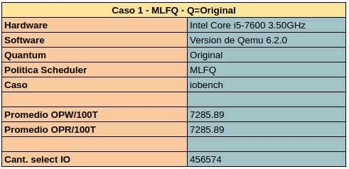
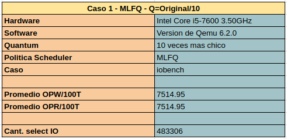


Se puede ver una mejora similar a la del planificador RR al disminuir el quantum, pero lo mas interesante no es comparar las mediciones de MLFQ entre si, sino hacerlo con las de RR.
Los resultados reflejan lo que veniamos anticipando, con un mejor rendimiento en comparacion al planificador de RR. 


### Caso 2 (1 CPU-bench corriendo solo)


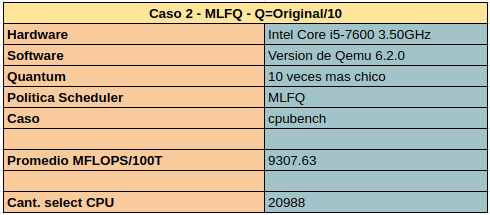


De nuevo los resultados son practicamente identicos entre si. 
En cuanto a la diferencia con RR, hay una minima diferencia (empeora el rendimiento) que podria incluso deberse a la aletoreidad de las pruebas, pero tambien a que los otros (pocos) procesos activos en el sistema tengan una prioridad mayor. Sin embargo, la diferencia es minima y esto no puede usarse para sacar conclusiones serias de nada, para esto habria que correrlo junto a mas procesos y analizar esos comportamientos (lo cual haremos a continuacion).


### Caso 3 (1 IO-bench y 1 CPU-bench corriendo en paralelo)

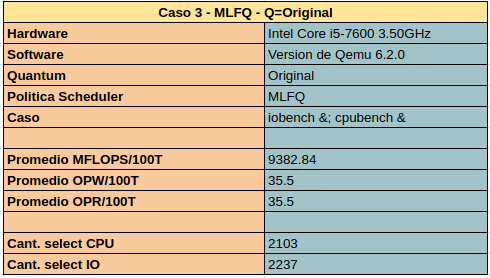


Interesantemente, los resultados son practicamente calcados a los conseguidos en las pruebas con el planificador de RR. Esto se debe a que al estar ejecutando unicamente dos procesos principales (sumado a eventualmente alguno de los procesos que puede estar ejecutando el SO) solo tiene dos opciones para elegir, por lo cual sin importar que tan baja sea la prioridad del proceso CPU-Bench, va a ser elegido despues de la ejecucion de IO-Bench.


### Caso 4 (2 CPU-bench corriendo en paralelo)

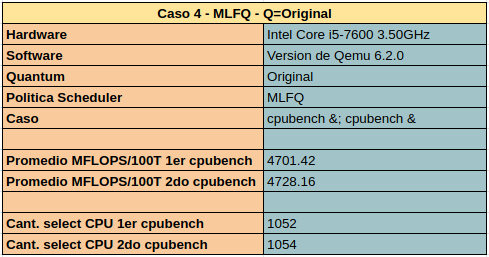
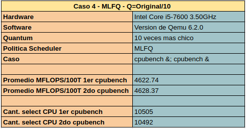


Este caso es muy similar al 2. No se puede sacar ninguna conclusión real de los numeros obtenidos. Los resultados son casi identicos a los obtenidos con RR.


### Caso 5 (1 IO-bench y 2 CPU-bench corriendo en paralelo)

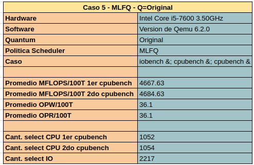
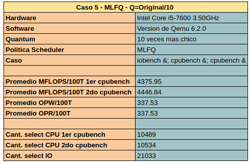


Este es quizás el caso mas interesante, ya que en las pruebas con MLFQ y quantum original se puede ver una mejora del 80% para el proceso IO-Bench respecto a las mediciones de RR con el mismo quantum y una mejora de mas del ¡¡100%!! con el quantum reducido (y en ninguno de los dos escenarios se perjudica a gran escala a los procesos CPU-Bench).
Ambos resultados eran esperables, ya que a priori el proceso IO-Bench deberia tener practicamente siempre una prioridad mayor que la de ambos CPU-Bench.


### Conclusiones 

Como era de esperarse, las políticas de MLFQ mejoraron el rendimiento de los procesos que tienen mayor necesidad de intercambio de entrada/salida. Esto es importante principalmente cuando se necesite un sistema con mejor tiempo de respuesta para la interaccion con el usuario o para realizar escritura y lectura de archivos. 
Otra conclusión que se puede sacar de estos resultados es que mientras mayor sea la cantidad de procesos activos en el sistema, mas se va a ver beneficiado por un algoritmo con prioridades como MLFQ un proceso con mayor cantidad de instancias de IO.


# Conclusiones generales

En este laboratorio pudimos entender mejor como hace el sistema operativo para "decidir" que procesos van a ser seleccionados para correr y como distribuye los recursos del sistema. 
Ademas, nos sirvio para comprender mejor la importancia que tiene el rol del planificador en el sistema operativo y la diferencia que pueden tener distintas políticas en la ejecución de los procesos.

En cuanto a las políticas en si, consideramos que MLFQ ofrece un rendimiento mas ideal, ya que mejora de forma notoria el rendimiento de procesos que tengan mas interactividad (lo cual es muy positivo en escenarios reales) mientras que no perjudica tanto a los procesos que requieren mas poder de computo. Esta característica del planificador MLFQ se hace mas notoria mientras mas procesos hayan en simultáneo, por lo que si hicieramos mas mediciones con casos que tengan mas procesos en paralelo la mejora de rendimiento de los IO entre RR y MLFQ seria aun mas notoria.

