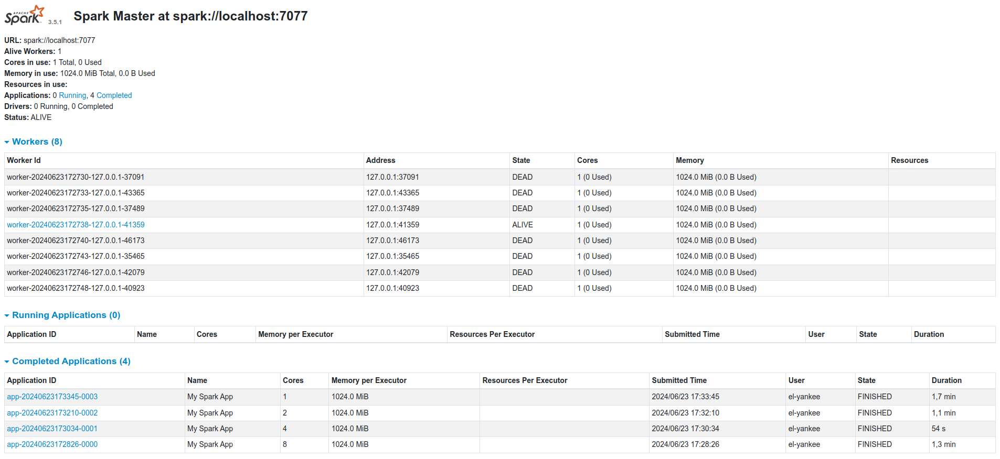

# Informe de laboratorio 3

### Autores:

- Angeli, Mateo
- Di Forte, Federico
- Usaj, Santiago

## Índice

1. [Objetivo](#objetivo)
2. [Nuestros pasos](#nuestros-pasos)
3. [Nuestra idea y cambios que hicimos](#nuestra-idea-y-cambios-que-hicimos)
   - [Config.java](#configjava)
     1. [heuristicKeySelection](#heuristickeyselection)
     2. [runNamedEntities](#runnamedentities)
   - [App.java](#appjava)
     1. [main](#main)
4. [Cómo compilarlo](#cómo-compilarlo)
5. [Análisis de uso de workers](#análisis-de-uso-de-workers)

## Objetivo

El objetivo del laboratorio es modificar el lector de feeds hecho previamente en el lab 2. El cambio que se realiza es que ahora es sobre una arquitectura distribuida, a través del framework _spark_.

## Nuestros pasos

Aquí vamos a mostrar los pasos que hicimos hasta llegar a la resolución del laboratorio:

1. Primero le preguntamos a chatGPT cómo instalar _spark_ y seguimos la guía:

   [Instalar Spark en Ubuntu](https://chatgpt.com/share/fc231e28-42b9-4500-bc4a-e173762ddc36)

2. Modificar proyecto maven de cero por mal funcionamiento:

   Tuvimos muchos problemas para poder compilar el codigo del lab2 en este lab debido a las rutas y configuracion del pom.xml. Un compañero recomendo crear un proyecto maven desde cero, asique intentamos eso. Nuevamente le pedimos ayuda a ChatGPT y seguimos los pasos que nos dio:

   [Crear Proyecto Maven](https://chatgpt.com/share/88f44268-6e85-4a76-aad1-cc16717fba94)

3. Copiar los archivos del lab2 a este lab:

   Ahora que ya teniamos el pom.xml arreglado, copiamos los archivos del lab anterior a este. Luego tuvimos que realizar modificaciones en los packages y los import en los archivos que lo solicitaban.

4. Inicializamos _spark_ en App.java:

   En todo este laboratorio hicimos un uso muy fuerte de Github Copilot, ya que quedamos asombrados de su utilidad, tanto como para explicarnos partes de codigo, como tambien para darnos una idea base para luego modificar y retocar. Le consultamos que debiamos incorporar en nuestro proyecto para utilziar _Spark_ y nos importo las clases necesarias y como configurarlo.

5. Eliminamos las clases `Article`, `FeedParser` y `FeedParser`:

   Como en este laboratorio se pide que le ingresemos un archivo .txt para realizar la busqueda de entidades, quitamos todas las funciones relacionadas con los feeds.

6. Paralelizamos la busqueda de candidatos en `heuristicKeySelection`:

   Se nos pidio que la busqueda de entidades sea paralelizada. Nuestro metodo de busqueda es primero encontrar quienes son candidatos a ser entidades, por eso debimos paralelizar esta parte del codigo.

7. Paralelizamos la creación de entidades en `runNamedEntities`:

   Una vez que obtuvimos los candidatos, tenemos que ver quienes son en efecto entidades. Esta parte tambien debe estar paralelizada.

8. Creamos el master y los workers:

   Se configuro la creacion del master y los workers. Otra vez ChatGPT nos ayudo ya que no estabamos logrando crear mas de un worker. Adjuntamos el chat donde fuimos haciendo diversas preguntas.

   [Configurar Master y Workers](https://chatgpt.com/share/45b10864-35b4-4e8e-81c1-89c013a68816)

## Nuestra idea y cambios que hicimos

En este laboratorio empezamos eliminando las clases `Article`, `FeedParser` y `FeedData`, las cuales habíamos implementado en el laboratorio 2 para obtener el XML de una URL de noticias y al parsear cada noticia obtener su título, descripción, fecha de publicación y el link. Ahora solo le ingresaremos un archivo `.txt` en vez de elegir que feeds leer.

Luego de esto, empezamos a paralelizar las funciones que tenemos en los archivos:

### Config.java

#### heuristicKeySelection:

En este método ahora le ingresamos un `JavaRDD<String>` el cual va a tener cada línea del archivo `.txt` que se le ingrese, y según la heurística que elegimos, obtendremos otro `JavaRDD<String>` con todos los candidatos.

#### runNamedEntities:

En este método generamos las entidades en base a los candidatos obtenidos utilizando `heuristicKeySelection`. Manteniendo la paralelización, guardamos la lista de entidades en un JavaRDD, y para esto tuvimos que implementar las clases `NamedEntity` y `DictionaryData` de forma serializable.

Para poder computar la `bigData`, se nos recomendo descartar las que no figuraban en el `dictionaryDataArray`, debido a que eran demasiadas. Si se quiere tomar a todos los candidatos como entidades, hay que sacar los comentarios desde la línea 150 hasta 159, el de la línea 130 y la linea 141 en el archivo `Config.java`.

Luego de obtener la lista de entitdades utilizamos `.collect()` para recopilar los resultados producidos por las tareas de RDD.

### App.java

#### main:

En main inicializamos _Spark_ utilizando los metodos `SparkConf()` y `JavaSparkContext`, donde `SparkConf()` crea una instancía de configuración. Aquí establecemos el nombre de la aplicación que aparecerá en la interfaz web de Spark con `setAppName` y con `setMaster` establecemos el master URL para la aplicación. Luego se ejecuta `JavaSparkContext` y este inicializa y configura una aplicación _Spark_ con las configuraciones proporcionadas por `SparkConf()`.

## Cómo compilarlo

Sea `APP_HOME` el directorio donde está este archivo `Informe.md`

```bash
$ cd $APP_HOME
$ mvn clean install
```

Sea `$SPARK_HOME` el directorio donde descomprimieron _spark_, ejecutamos las siguientes líneas para inicializar el master y los workers:

```bash
$ sbin/start-master.sh
```

```bash
$ sbin/start-worker.sh spark://localhost:7077
```

En el caso de querer modificar la cantidad y configuracion de los workers se debe modificar en el archivo `conf/spark-env.sh` los siguientes valores:

```bash
SPARK_WORKER_INSTANCES=4    # Cantidad de workers
SPARK_WORKER_CORES=1        # Cantidad de Cores de cada worker
SPARK_WORKER_MEMORY=1g      # Cantidad de Memoria de cada worker
```

En el directorio `$SPARK_HOME` pueden usar `bin/spark-submit` y para no ver la información de _spark_ pueden redirigir `stderr` a `/dev/null`:

```bash
$ bin/spark-submit --master spark://localhost:7077 ~$APP_HOME/target/lab3-1.0-SNAPSHOT.jar ~$APP_HOME/data/quijote.txt ~$APP_HOME/src/main/java/grupo43/data/dictionary.json -ne 1 -sf cat 2>/dev/null
```

Con -ne se elige que heuristica utilizar ("1" , "2" o "3") y con -sf el formato de las estadisticas ("cat" o "topic"). En lugar de utilizar quijote.txt, pueden utilizar el .txt del que desean obtener las entidades.

## Analisis de uso de workers

Se nos pidio evaluar el desempeño utilizando 1, 2 y 4 workers, por curiosidad tambien decidimos probar con 8 workers. Como parametro de comparacion vamos a utilizar el tiempo de ejecucion que nos proporciona la interfaz web de spark:



Como supusimos, el tiempo de ejecucion se reduce a medida que le vamos agregando workers, pero agregarlos siempre incluye un costo extra, por lo que en un punto deja de ser conveniente. En estos casos evaluados observamos que entre 4 y 8 workers se encuentre el punto donde la tarea de repartir los trabajos entre ellos pasa a ser mas costosa que la ejecuion misma del programa.
