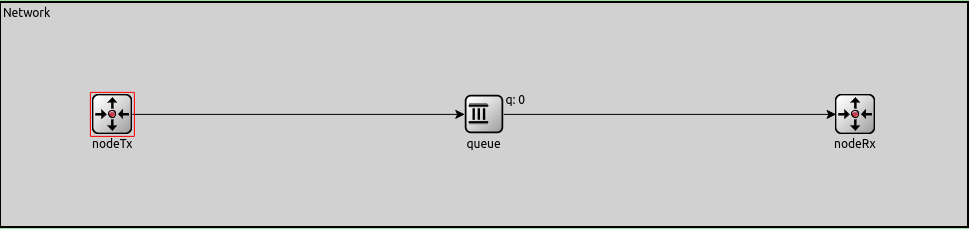
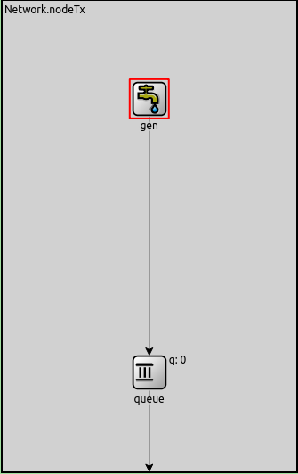
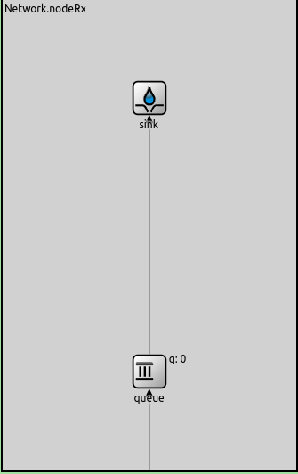
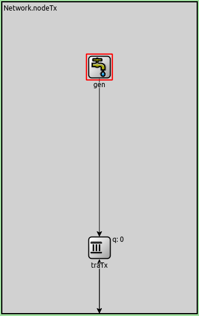
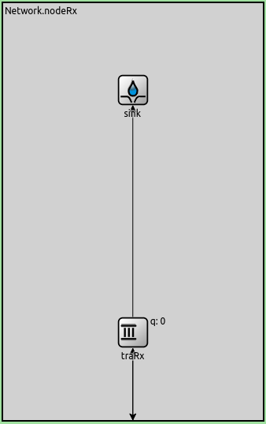

# Análisis de congestion y control de flujo en esquema productor-consumidor con simulación discreta

### Resumen:

Este informe cuenta con dos partes principales. En la primera se analizan y comparan dos casos distintos con problemas de congestion/control de flujo, mientras que en la segunda se propone un algoritmo para intentar manejar estos problemas.

#### Autores:

- Angeli, Mateo
- Di Forte, Federico
- Usaj, Santiago

## Índice

1. [Introducción](#introduccion)

   1.1. [Esquema de Red](#esquema-de-red)

   1.2. [Flujo y congestión](#flujo-y-congestión)

   1.3. [Marco metodológico](#marco-metodológico-simulación-discreta)

2. [Métodos](#métodos)
3. [Resultados](#resultados)
4. [Discusión](#discusión)
5. [Referencias](#referencias)

## Introducción

### Esquema de red

La red que se analiza en este trabajo cuenta con un esquema muy simple, el cual consta de 3 componentes principales. Un nodo generador, un nodo receptor, y un buffer intermedio que los comunica.

|  |  |
| ------------------------------------------------- | ------------------------------------------------- |

Cada nodo cuenta además con un buffer interno, simulando (un poco) mejor como seria una conexion muy basica entre dos componentes de una red con buffers de entrada/salida y un intermediario.

### Flujo y congestión

Los problemas que se busca estudiar en este trabajo son el flujo y la congestión en redes de comunicación (mas especificamente el control de estos).

El **control de flujo** es necesario en una red cuando los datos emitidos en una red son mayores a la capacidad de el o los receptores para procesarlos. Cuando esto sucede se utiliza algun algoritmo para control de flujo, el cual se encarga de reducir los datos emitidos en la red. Esto es necesario, porque de lo contrario el buffer de el o los receptores podria llenarse, mientras que los emisores siguen enviando datos y asi generar una perdida de paquetes.

El **control de congestión** es necesario en una red cuando los datos emitidos en una red son mayores a la capacidad que esta tiene para transmitirlos a el o los receptores. Cuando esto sucede se utiliza algun algoritmo para control de congestión, el cual se encarga de reducir los datos emitidos en la red. Esto es necesario, porque de lo contrario algun buffer en el camino que deben tomar estos datos podria llenarse, mientras que los emisores siguen enviando datos y asi generar una perdida de paquetes.

Como se puede ver ambos problemas son muy similares, por lo cual en un nivel muy básico pueden ser tratados de manera similar.

### Marco metodológico (simulación discreta)

Para el análisis del funcionamiento de la red y del algoritmo implementado por nosotros en distintos casos se van a realizar simulaciones discretas, utilizando el programa Omnet++.
La ventaja que presenta el uso de simulaciones discretas (o por eventos discretos), es que presenta una mayor flexibilidad a quien las quiere estudiar para manejar como avanza el tiempo, ya que este se divide en eventos discretos que suceden cada cierto intervalo de tiempo. Despues de cada uno de estos intervalos se actualiza el estado de la simulación, permitiendo ver paso a paso como van afectando los distintos eventos al estado de la simulación o tambien realizar simulaciones que tomarian un gran tiempo real de forma mas rápida.

### Análisis de los problemas

Lo primero que se hizo fue medir el funcionamiento de nuestra red básica en dos casos distintos, uno con un problema de flujo y el otro de congestion.

#### Parámetros de nuestra red:

- **Tamaño de los buffer:** tanto para el buffer intermedio como para el de nodeRx se fijo en 200, mientras que para nodeTx en 2000000. La idea es que el tamaño de los primeros dos sea algun valor arbitrario pero que se pueda quedar sin espacio durante la simulacion si hubiese algun problema, mientras que el de nodeTx sea "infinito" en la práctica.
- **Intervalo de generación:** se tomaron medidas asignandole distintos valores, pero siempre se utilizo una distribucion exponencial, variando su parametro entre 0,1 y 1.
- **Tamaño de los paquetes:** se establecio en 12500 bytes.
- **Transmisión entre nodos:** para la conexión entre nodeTx y el buffer intermedio se fijo una velocidad de 1Mbps, mientras que la conexion entre el buffer y nodeRx fue distinta entre los dos casos:

  **Caso 1**: la conexión entre el buffer y nodeRx tiene una velocidad de 1Mbps

  **Caso 2**: la conexión entre el buffer y nodeRx tiene una velocidad de 0.5Mbps

- **Velocidad de procesamiento del receptor:** es la velocidad que tiene la transmisión de paquetes del buffer interno en nodeRx hacia el sink. Tambien esta divida en dos casos:

  **Caso 1**: la conexión entre el buffer y sink tiene una velocidad de 0.5Mbps

  **Caso 2**: la conexión entre el buffer y sink tiene una velocidad de 1Mbps

#### Mediciones

Para las simulaciones de donde se extrajeron los próximos datos se fijo una duración de 200 segundos. Además, para cada caso se tomaron las medidas con intervalos de generacion de 0.1, 0.15, 0.2 y 0.3

#### Tamaños de los buffer

| Caso | 0.1                                                       | 0.15                                                       | 0.2                                                       | 0.3                                                       |
| ---- | --------------------------------------------------------- | ---------------------------------------------------------- | --------------------------------------------------------- | --------------------------------------------------------- |
| 1    | .png>) | .png>) | .png>) | .png>) |
| 2    | .png>) | .png>) | .png>) | .png>) |

#### Tiempo de vida de los paquetes

| Caso | 0.1                                                      | 0.15                                                      | 0.2                                                      | 0.3                                                      |
| ---- | -------------------------------------------------------- | --------------------------------------------------------- | -------------------------------------------------------- | -------------------------------------------------------- |
| 1    | .png>) | .png>) | .png>) | .png>) |
| 2    | .png>) | .png>) | .png>) | .png>) |

#### Pérdida de paquetes

Lo primero que se puede notar al ver los datos, es el gran parecido que hay entre las mediciones de ambos casos (por no decir que son idénticas). Esto era algo predecible, debido a que en ambos la red que se usa es prácticamente la misma, con un ligero cambio en donde se busca generar el "cuello de botella".

Luego, si se busca comparar resultados entre los distintos intervalos de generación, se puede notar que estos "mejoran" (siendo mejor tener menor delay y menos paquetes perdidos) a medida que el valor del intervalo crece, lo cual reduce la cantidad de paquetes enviados. Al testear con distintos valores se encontro que alrededor de 0.2 se dejaban de perder paquetes, por lo cual se eligio este valor para mostrar en el informe y 0.3 para demostrar que si este valor sigue subiendo los resultados de demora en los paquetes mejoran aun mas, pero la cantidad de paquetes logicamente disminuye.

En cuanto a los gráficos del **tamaño de los buffer** y de **pérdida de paquetes**, si se ven de cerca los datos se puede notar que es al mismo tiempo que alguno de los buffers se llena (depende el caso si el intermedio o el de nodeRx) cuando comienza la pérdida de los paquetes. Esto sucede porque al no poder recibir los paquetes, ni tener otra conexión a donde puedan ser mandados a la red no le queda otra opcion que descartarlos.

Otra observacion podria ser como en los dos casos que llegan a saturar la red los valores aumentan de una forma aproximadamente lineal. Esto se debe a que los valores de producción y consumo en la red son siempre constantes.

Respecto al **tiempo de vida de los paquetes**, tambien se puede ver que al saturar alguno de los buffers, el grafico se estabiliza alrededor de los 40s. Este es el tiempo que le toma a la conexión con el cuello de botella procesar los 200 paquetes que tiene en el buffer.

Por último, el único gráfico con alguna diferencia clara entre los casos es el de los paquetes en buffer, siendo la diferencia cual de estos es el que crece hasta alcanzar 200. Si se vuelve a la seccion de [Parametros de la red](#parámetros-de-nuestra-red), es fácil ver que la razón de que esto suceda es que las conexiones entre el buffer intermedio con nodeRx y del buffer interno de nodeRx con el sink tienen los mismos valores pero intercambiados. Esto produce que en el caso 1, nodeRx reciba mas paquetes de los que es capaz de procesar, provocando que todos los paquetes perdidos sean ahi y viceversa.

## Métodos

### Idea del algoritmo

Al comenzar a idear una solución para esta pérdida de paquetes, lo primero que consideramos necesario es alguna forma de comunicacion "hacia atras", es decir, que se puedan mandar mensajes desde `nodeRx` a `nodeTx`. Para esto se creo un canal de comunicación con la siguiente forma:

|  |  |
| ------------------------------------------------- | ------------------------------------------------- |

Luego, cuando un buffer este por llenarse, este le manda una señal a `nodeTx` para que disminuya el envío de paquetes y asi le de tiempo a procesar los que ya tiene en la cola sin llegar a saturarse, evitando la pérdida de paquetes.

### Implementación

Una vez planeada la idea básica de nuestro algoritmo, tocaba llevarlo a la práctica. Como era de esperarse, nos encontramos con algunos problemas y limitaciones por la estructura de nuestra red. Algunas de estas fueron:

- Cómo se conectarían `nodeRx` y `nodeTx`, siendo que sus elementos tienen una entrada y una salida.
- Cómo notificaría el buffer intermedio a `nodeTx` que se esta por llenar.

Para solucionar el primer problema, se cambiaron las queues de ambos nodos, por nuevas estructuras `TransportTx` y `TransportRx`, las cuales cuentan con un canal fijo de input y output, los cuales estan permanentemente conectados con generator y sink respectivamente. Además, ambos tienen un canal de input/output, lo cual permite que `nodeTx` tenga dos entradas y que `nodeRx` tenga dos salidas. De esta forma se pueden conectar estos nodos mediante un nuevo buffer intermedio, pero llevando datos en el sentido contrario a la conexión ya existente.

Luego, `nodeRx` ya podría notificar al generador cuando su buffer esta por llenarse. Tambien se podría pensar que esta resuelto el problema para el buffer intermedio, este mandaria un aviso a `nodeRx` y el procedimiento seria el mismo, pero _¿Cómo puede diferenciar el nodo que el paquete que tiene este mensaje es distinto a los demás?_ Para solucionar este problema se usa un campo en los mensajes que indica que no se trata de datos sino de una de estas notificaciones.

Una vez resueltos estos problemas, se paso a la implementación mas en detalle. Lo primero fue establecer cuando se envían las señales para que se envien menos paquetes. Se decidió que cuando un buffer llegue al 80% de su capacidad, este envie automaticamente la señal, sin importar cuantos elementos tenga "por delante" esperando a ser enviados y que cuando esta capacidad baja a 30% el envío de paquetes vuelva a la normalidad. Otro paramétro que había que establecer, es en cuanto se reduce esta transmisión de paquetes desde `nodeTx`. El valor fue elegido de forma arbitraria y se establecio a un cuarto de la capacidad de la red.

Nuestra hipotesis antes de llevar adelante pruebas es que esto deberia evitar la pérdida de paquetes en la red, sin comprometer la cantidad de paquetes recibidos por el sink. Además, es probable que el delay de los paquetes aumente por encima del techo de los 40 segundos que se encontro en las mediciones anteriores, ya que este limite era alcanzado (y se mantenía) porque se tenian en cuenta unicamente a los paquetes que no eran descartados.

## Resultados

Para las mediciones tomadas con nuestro algoritmo ya implementado, se decidió utilizar unicamente los intervalos de generacion 0.1 y 0.15, ya que para los intervalos de 0.2 o superior nunca se llegaba a ocupar el 80% de ningún buffer, por lo cual los resultados son analogos a los mostrados anteriormente.

#### Tamaños de los buffer

| Caso | 0.1                                                       | 0.15                                                       |
| ---- | --------------------------------------------------------- | ---------------------------------------------------------- |
| 1    | .png>) | .png>) |
| 2    | .png>) | .png>) |

#### Tiempo de vida de los paquetes

| Caso | 0.1                                                      | 0.15                                                      |
| ---- | -------------------------------------------------------- | --------------------------------------------------------- |
| 1    | .png>) | .png>) |
| 2    | .png>) | .png>) |

#### Pérdida de paquetes

| Caso | 0.1                                                       | 0.15                                                       |
| ---- | --------------------------------------------------------- | ---------------------------------------------------------- |
| 1    | .png>) | .png>) |
| 2    | .png>) | .png>) |

En estas mediciones, se puede ver que los resultados cumplen con lo esperado. Con esta implentacion del algoritmo, se consigue evitar el problema de la pérdida de paquetes, pero cabe destacar que esto no es "gratis" ya que a cambio el delay de los paquetes aumenta. Otro efecto secundario de haber realizado estos cambios, es que se puede ver como ahora el buffer de `nodeTx` ahora es utilizado, lo cual no es un problema en si, pero crece de forma bastante lineal por lo que si esta red estuviese activa por un mayor tiempo y el generador nunca frenara, se podria volver a producir pérdida de paquetes.

#### Carga útil

| Red original                                     | Red con algoritmo implementado                   |
| ------------------------------------------------ | ------------------------------------------------ |
|  |  |

Por último, una métrica que se puede utilizar para comparar la utilidad es la de la carga util, es decir, una comparación entre cuantos paquetes son generados por segundos y cuantos son procesados. Viendo los resultados puestos en la tabla de nuevo son muy similares entre si y se puede ver como la cantidad de paquetes generados es igual a los procesados hasta que se llega a producir 5 por segundo (0.2 de generation_interval). Luego, es cuando comienzan en un caso a perder paquetes y en el otro a reducir la transmision desde el nodo generador.

## Discusión

Cómo se pudo apreciar en los resultados, el algoritmo propuesto cumple con lo que se esperaba de él, pero no es perfecto. Hay aspectos que se podrían mejorar refinando los parámetros y hay otros que sería necesario mejorar para redes mas complejas.

La principal mejora que se nos ocurre es ajustar mejor cuando se mandan las señales para que la transmisión aumente o disminuya y en cuanto esta aumenta o disminuye. Se podría utilizar aun mejor la capacidad de la red. Esto no mejoraría la eficiencia de nuestra red por ser muy simple, pero seria importante en redes mas complejas.

## Referencias

Se utilizo el manual de Omnet++ y los videos proporcionados por la catedra en el aula virtual para realizar este trabajo. Ademas nos sirvio de ayuda Copilot para poder generar los graficos.

## Anexo

Aqui tenemos los links a los codigos para generar todas las graficas, se siguió uno de los videos y ayuda de Copilot para poder hacerlos.

[Grafico de tamaño de buffer, delay y tiempo de vida](https://colab.research.google.com/drive/1onWKi1NWMGRZk9dhUrR9ezVJkWobfBvl?usp=sharing)

[Grafico de carga y carga de delay](https://colab.research.google.com/drive/1KbCvIKeNjTQ7B1JYV5Ps8_dUIek_rKWP?usp=sharing)
