# Análisis de congestion y control de flujo en esquema productor-consumidor con simulación discreta

### Resumen:

En este informe se hara un analisis y comparación de dos algoritmos de enrutamiento para redes "anillo".

#### Autores:

- Angeli, Mateo
- Di Forte, Federico
- Usaj, Santiago

## Índice

1. [Introducción](#introduccion)

   1.1. [Esquema de Red](#esquema-de-red)

   1.2. [Marco metodológico](#marco-metodológico-simulación-discreta)

2. [Métodos](#métodos)
3. [Resultados](#resultados)
4. [Discusión](#discusión)
5. [Referencias](#referencias)

## Introducción

### Esquema de red

La red que se utilizara como objeto de estudio cuenta con 8 nodos conectados en forma de "anillo", es decir, que cada uno se conecta con 2 nodos distintos, formando un círculo. Ademas cada nodo cuenta dentro con una capa de aplicacion, una de red y dos de enlace. La idea es que la capa de aplicación de cada nodo puede generar y enviar paquetes a los demas nodos y su capa de red debe decidir el enrutamiento de estos paquetes ademas de los que puedan llegar de los nodos vecinos. Si un paquete llega a su nodo de destino la capa de red debe enviarlo a su capa de aplicacion para que esta lo procese.

| 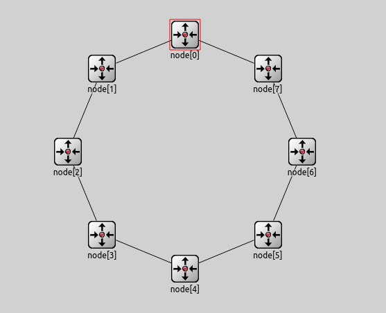 | 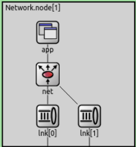 |
| ------------------------------ | ------------------------------------- |

### Marco metodológico (simulación discreta)

Para el análisis del funcionamiento de la red y del algoritmo implementado por nosotros en distintos casos se van a realizar simulaciones discretas, utilizando el programa Omnet++.
La ventaja que presenta el uso de simulaciones discretas (o por eventos discretos), es que presenta una mayor flexibilidad a quien las quiere estudiar para manejar como avanza el tiempo, ya que este se divide en eventos discretos que suceden cada cierto intervalo de tiempo. Despues de cada uno de estos intervalos se actualiza el estado de la simulación, permitiendo ver paso a paso como van afectando los distintos eventos al estado de la simulación o tambien realizar simulaciones que tomarian un gran tiempo real de forma mas rápida.

### Análisis de los problemas

Para los analisis del funcionamiento de la red y su algoritmo de enrutamiento se utilizaran dos casos de estudio

- Caso 1: Se envian datos desde los nodos 0 y 2, con destino en el nodo 5.
- Caso 2: Se envian datos desde los 7 nodos restantes hacia el nodo 5.

El primer algoritmo de enrutamiento que se utilizara es muy básico. Si la capa de red que esta haciendo handle de un paquete es la del nodo destino lo manda a su capa de aplicación, sino siempre es enviado hacia la interfaz de capa de enlace 0 (en sentido horario en nuestra imagen de la red). La idea es diseñar un algoritmo de enrutamiento que mejore el funcionamiento de la red de alguna forma. Las métricas que vamos a utilizar para analizar estas mejoras seran el tamaño de los buffers en cada nodo, el delay que tiene cada paquete y la cantidad de saltos que debe dar un paquete (cantidad de nodos por los que pasa).

## Métodos

### Idea del algoritmo

Utilizando los conocimientos de la parte teorica de la materia, se nos ocurrio implementar un algoritmo al estilo del que utiliza el protocolo de estado de enlace, pero aprovechando la topología particular de esta red.

Con nuestro algoritmo, cada vez que un nodo quiere establecer una conexión con otro, envia por izquierda y por derecha un mensaje al estilo del "hello" de estado de enlace, que llegan al destino y este devuelve otro mensaje con la informacion de cuantos saltos debio realizar el paquete para llegar a destino. Asi, el nodo que esta enviando los datos va a saber por que lado tiene el camino mas corto hacia el receptor.

### Implementación

Para poder diferenciar los paquetes "hello" o de identificacion de los paquetes que tendrian los datos transmitidos en la conexion, se utilizan distintos tipos de paquetes (con `pkt->setKind()`). Asi, los tipos 1 y 2 son los primeros paquetes enviados al destino, los 3 y 4 las respuestas de estos y los 5 y 6 los mensajes "comunes".

## Resultados

Las simulaciones hechas para testear el funcionamiento de los algoritmos tuvieron una duracion de 200 segundos. Ademas, para el caso 2 se decidió cambiar el valor de `interArrivalTime` a exponentiail(4), para que se generen menos paquetes por segundo. Originalmente, con exponential(1), se generaban tantos paquetes en la red que los resultados con nuestro algoritmo eran igual de malos que con el original. Al generar menos paquetes por segundo, se le da tiempo a los nodos a manejar mejor el flujo y que los buffers no se llenen.

#### Caso 1

| Algoritmo Original                                                | Algoritmo Propuesto                                                |
| ----------------------------------------------------------------- | ------------------------------------------------------------------ |
| 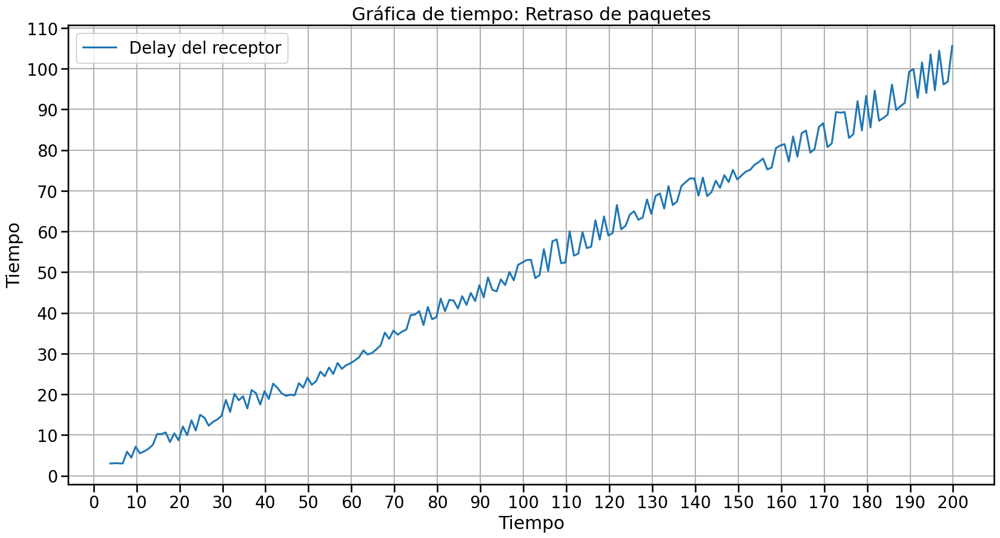  | 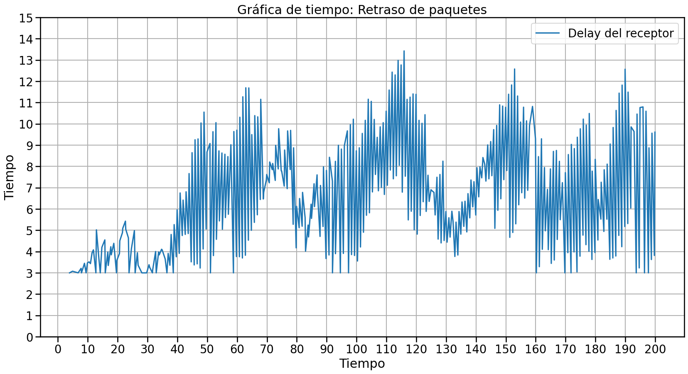  |
| 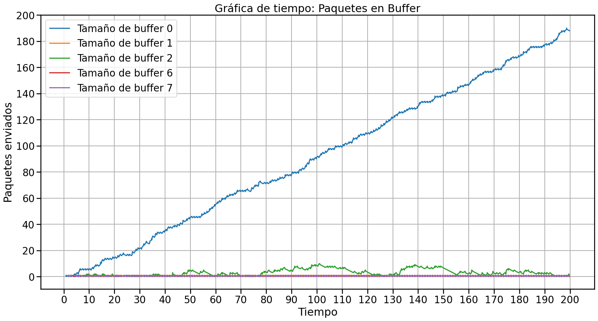 |  |
| 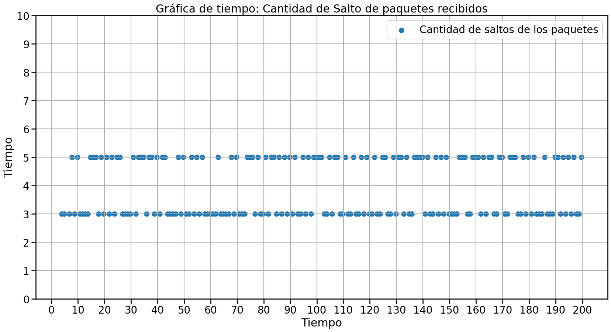 | 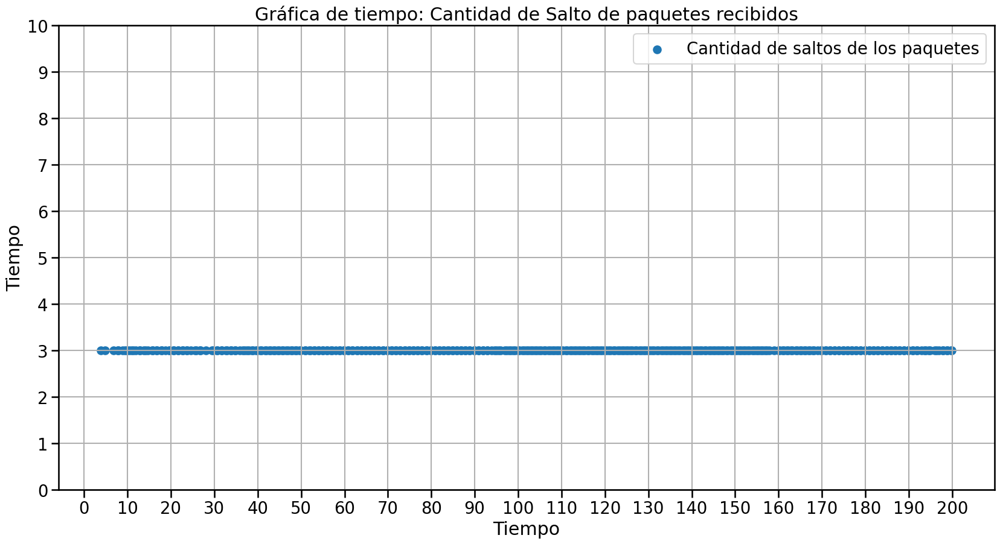 |

En este caso, se puede ver el principal punto debil del algoritmo original. Al enviar todos los paquetes por el mismo camino, es muy facil que alguno de los buffers se sature y esto genere un gran delay en la red. En este caso, el buffer del nodo 0 debe manejar tanto los paquetes que el genera, como los que le llegan desde el nodo 2, lo que genera un gran cuello de botella.

Por otro lado, en el algoritmo mejorado, los mensajes toman rutas totalmente distintas, por lo que la red esta preparada para manejarlos de forma apropiada.

#### Caso 2

| Algoritmo Original                                                | Algoritmo Propuesto                                                |
| ----------------------------------------------------------------- | ------------------------------------------------------------------ |
| 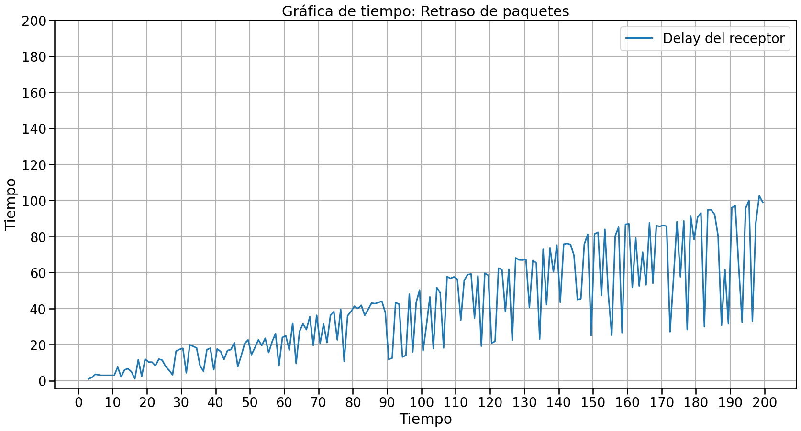  |   |
| 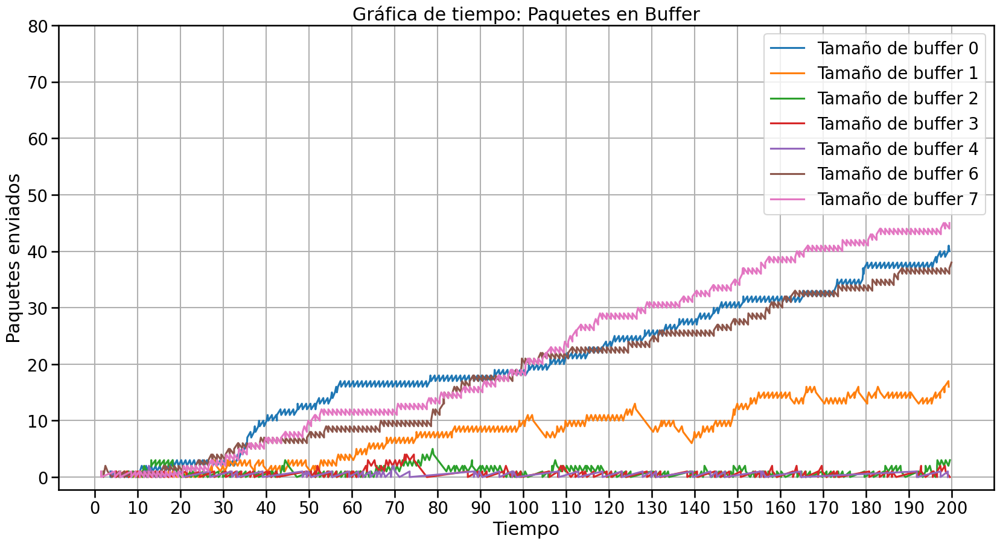 | 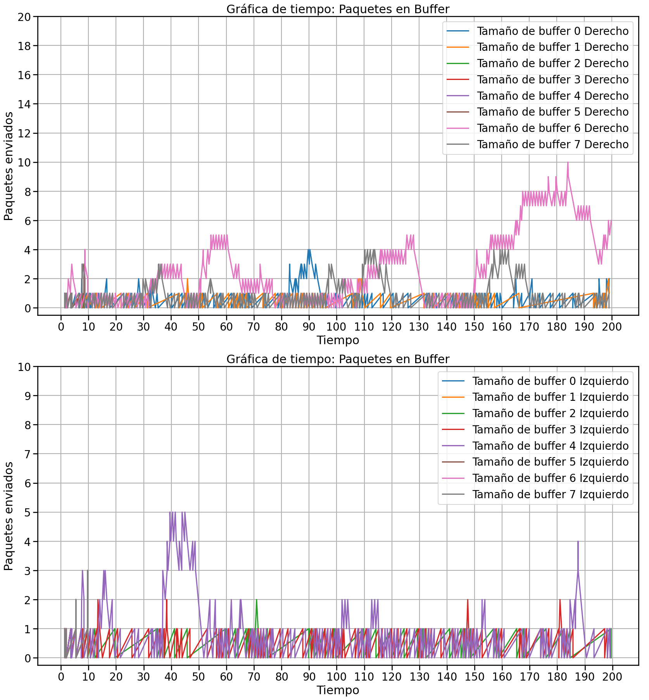 |
| 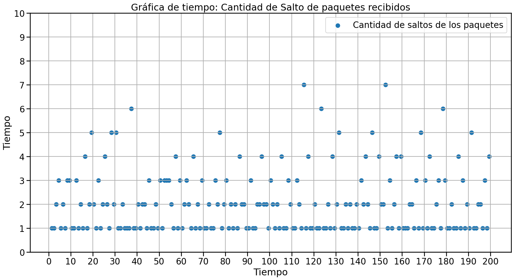 | 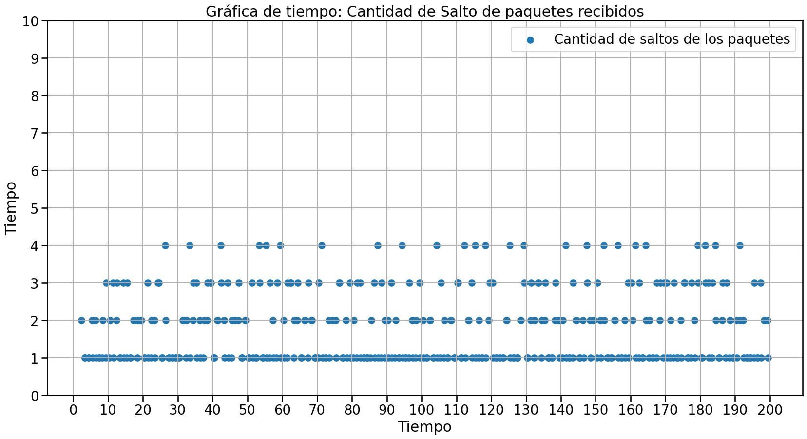 |

Como se dijo anteriormente, con los valores de originales de la red, se producian cuellos de botella en muchos nodos incluso con el algoritmo mejorado, el cual tenia mejoras muy chicas pero el crecimiento del tamaño de los buffers y la demora seguia siendo lineal.

Al cambiar estos valores para que la cantidad de paquetes sea menor, se pudo ver como con el algoritmo original se seguian generando grandes cuellos de botella en los cercanos al de destino, mientras que con el mejorado, al dividirse mejor la carga entre los nodos, se lograba manejar mejor el flujo de los paquetes, evitando el crecimiento constante en los buffers y en el delay.

## Discusión

El algoritmo que se presentó, tiene un funcionamiento muy basico y que aprovecha las ventajas de conocer la topología específica de la red. Si se quisiera aplicar a cualquier red que no sea un anillo, lo mas probable es que falle en la gran mayoria de los casos.

Aun así, el algoritmo no es perfecto para redes de anillo. Algunas mejoras que se podrían hacer estan relacionadas a detectar problemas en la transmision de los datos, con una seleccion dinámica de cual es el camino mas apropiado segun el estado de los buffers a recorrer. Por ejemplo, si los nodos 1, 2 y 3 quisieran enviarle datos al nodo 0, el funcionamiento del algoritmo mejorado seria equivalente al del original, mientras que si se tuviera en cuenta la saturacion de los buffers, se podrian utilizar caminos mas largos pero que eviten problemas de congestion.

## Referencias

Utilizamos los conocimientos previamente adquiridos en el laboratorio anterior, por ende no hizo falta mucha busqueda externa. Nuevamente Copilot nos ayudo a lograr ciertas ideas que no lograbamos implementar.

## Anexo

Aqui tenemos los links a los codigos para generar todas las graficas.

[Grafico de delay, buffer y saltos](https://colab.research.google.com/drive/1cwg0WoKNCu6yNtzmJALcx4LPjKAiKbIw?authuser=2)
